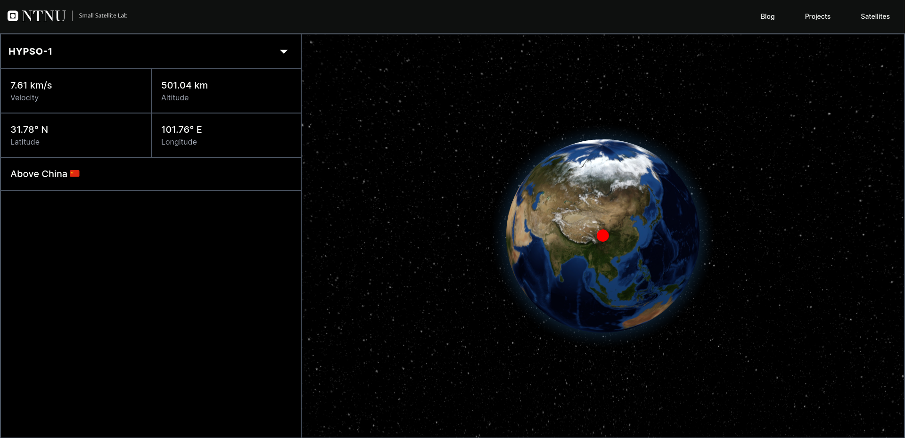

# Hypso Space Outreach Website
The Hypso Space Outreach Website is an interactive web page developed for the general public. It includes features such as a mission tracker, mission status, maps, and an easy to use blog. 

## General Information  

* Country: 🇳🇴 Norway  
* Customer: NTNU SmallSat Lab  
* Platform: Web  
* Framework: React  
* Period: Spring 2024  
* Status: Done

## Project Structure

* [`/docs/`](/docs/): Contains technical documentation.
* [`/backend/`](/backend/): Backend code and local setup instructions.
* [`/frontend/`](/frontend/): Frontend code and local setup instructions.
* [`/.vscode/`](/.vscode/): IDE settings (if applicable).
* [`/.github/`](/.github/): GitHub repository settings (e.g., issue templates, workflows).

## Getting Started

Goto [`/docs/README.md`](/docs/README.md) to read more about the project.

## Contributing

Contributions are welcome, for more information, refer to the documentation in the `/docs/` folder.
