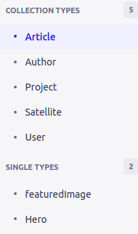
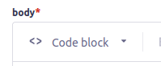
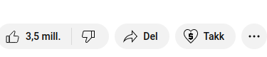
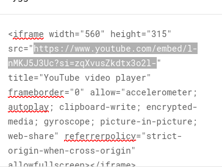

## Strapi

It is advisable to have some knowledge about strapi before using this application. Please refer to this introduction:

https://docs.strapi.io/dev-docs/intro

When first loading up strapi, you will see see 7 different types.

## Article

In the article collection type, there are 6 fields you can fill. slug, datePublished, coverImage, body, author, tag and previewTitle.

The slug is an identifier that can be autogenerated or manually generated.

DatePublished is the date when the article was published or written.

CoverImage is the image that is displayed on the preview.

Body is the content that is displayed when clicking on a specific blog. In Blog you can add images, and text.

In the body, you are also able to add youtube videos. To be able to do that, you need to do the following[^1]:

1. Find a youtube video
2. Click on share button 
3. Click on embed button 
4. Copy the source 
5. Click on the link button in the body field 
6. Final step is to add the link you copied from step 4.

Author is a relation to another author collection type.

Tag is a tag that can be used for filtering the blogs by tags.

Preview title is the title only dislayed on the blog-card.

## Author

In author you can add the following fields:

1. Name
2. Avatar
3. Articles

Name is the name of the author

Avatar is the profile image of the author. If avatar is not provided, the initials will be used for the author avatar.

Articles are the articles the author has written

## Project

In project there are 5 fields:

1. Title
2. Slug
3. Satellites
4. Content
5. Preview Image

Title will only be displayed on the project preview card (same as article)

Slug is an identifier for the project

Satellites are the related satellites

Content is the content of the project. Here you can also add images and youtube embeddings. Refer to this [^1]: tutorial to add youtube embeddings.
