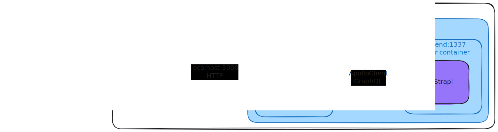

# Tech stack

Our tech stack is a combination of modern and powerful tools and frameworks that help us build robust, scalable, and efficient applications.

## Quick overview

---

| **Tool/Framework**                              | **Category**            | **Purpose**                                                                           | **License** |
| ----------------------------------------------- | ----------------------- | ------------------------------------------------------------------------------------- | ----------- |
| [React](https://react.dev/)                     | Frontend Development    | A JavaScript library for building user interfaces                                     | MIT         |
| [Next.js](https://nextjs.org/)                  | Frontend Development    | Server-side rendering and routing for React applications                              | MIT         |
| [Tailwind CSS](https://tailwindcss.com/)        | Frontend Development    | Utility-first CSS framework for rapid styling and customization                       | MIT         |
| [shadcn/ui](https://ui.shadcn.com/)             | Frontend Development    | Reusable UI components                                                                | MIT         |
| [Framer Motion](https://www.framer.com/motion/) | Frontend Development    | Animation library for React                                                           | MIT         |
| [Node.js](https://nodejs.org/en)                | Server-Side Development | JavaScript runtime environment for building server-side applications                  | MIT         |
| [npm](https://www.npmjs.com/)                   | Package Management      | Managing project dependencies and development tools for Node.js                       | Apache-2.0  |
| [Strapi](https://strapi.io/)                    | Backend Development     | Headless CMS (Content Management System) for building and managing APIs               | MIT         |
| [Docker](https://www.docker.com/)               | Containerization        | Packaging applications and dependencies for consistent deployment across environments | Apache 2.0  |
| [Playwright](https://playwright.dev/)           | Testing                 | End-to-end testing framework for web applications                                     | Apache 2.0  |

---

## Networking

The whole site is reverse proxied behind Apache, running as a service on the server.

Our networking stack uses [Docker Compose](https://docs.docker.com/compose/) to containerize our applications such that they can easily talk to each other.

The containers communiate using [GraphQL](https://graphql.org/) and [Apollo Client](https://www.apollographql.com/docs/react/)

